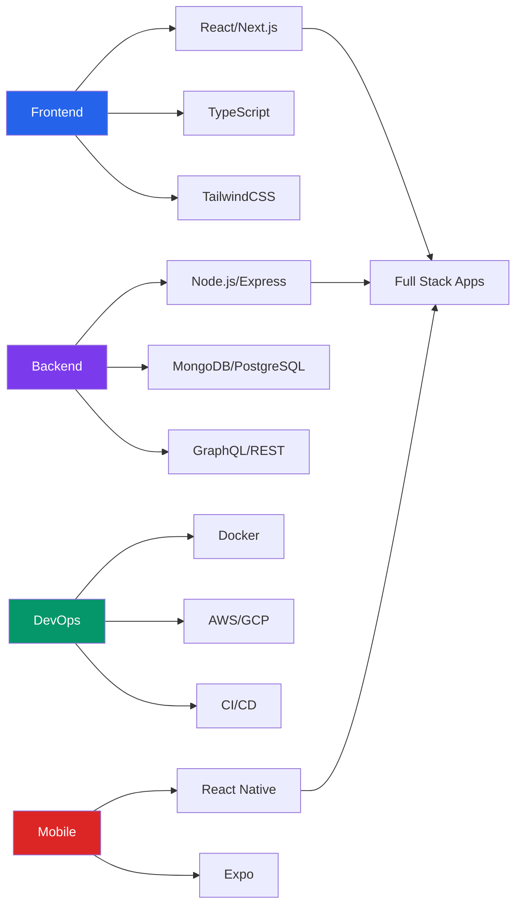
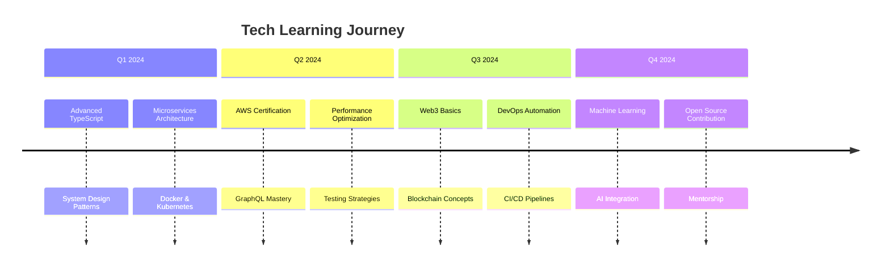

# Suman Bashyal ⚡

<div align="center">
  
### 🚀 **Senior Fullstack Developer | MERN Specialist | Cloud-Native Architect**
  
[](https://git.io/typing-svg)


</div>

---

## 🏆 **Technical Profile**

<div align="center">
  


<p align="center">
  <a href="https://www.linkedin.com/in/shumanbashyal">
    
  </a>
  <a href="mailto:shumanbashyal@gmail.com">
    
  </a>
  <a href="https://sumanbashyal.vercel.app">
    
  </a>
  <a href="https://calendly.com/suman-bashyal">
    
  </a>
</p>

</div>

---

## 🔥 **Tech Stack Mastery**

### **💻 Core Competencies**
<table align="center">
  <tr>
    <td align="center" width="96">
      
      <br>React
      <br>★★★★★
    </td>
    <td align="center" width="96">
      
      <br>Next.js
      <br>★★★★★
    </td>
    <td align="center" width="96">
      
      <br>Node.js
      <br>★★★★★
    </td>
    <td align="center" width="96">
      
      <br>TypeScript
      <br>★★★★★
    </td>
    <td align="center" width="96">
      
      <br>MongoDB
      <br>★★★★☆
    </td>
  </tr>
  <tr>
    <td align="center" width="96">
      
      <br>Express
      <br>★★★★★
    </td>
    <td align="center" width="96">
      
      <br>Tailwind
      <br>★★★★★
    </td>
    <td align="center" width="96">
      
      <br>GraphQL
      <br>★★★☆☆
    </td>
    <td align="center" width="96">
      
      <br>Docker
      <br>★★★☆☆
    </td>
    <td align="center" width="96">
      
      <br>AWS
      <br>★★☆☆☆
    </td>
  </tr>
</table>

### **📊 Tech Ecosystem**


---

## 📈 **GitHub Analytics & Metrics**

<div align="center">

### **Productivity Dashboard**
  
| Metric | Status |
|--------|--------|
| **Daily Coding Streak** |  |
| **Contribution Graph** |  |

### **Performance Metrics**
  
<div style="display: flex; justify-content: center; gap: 20px;">
  


</div>

### **Achievement Trophies**
  


</div>

---

## 🏗️ **Featured Projects**

### **🎯 Currently Building**
<div align="center">

| Project | Stack | Status | Description |
|---------|-------|--------|-------------|
| **🍔 FeastFlow** | React Native, Node.js, MongoDB | 🚧 In Progress | Next-gen food delivery platform with real-time tracking |
| **⚡ CodeCollab** | Next.js 14, Socket.io, Redis | 🔄 Active Dev | Real-time collaborative code editor |
| **🔐 AuthFlow Pro** | Express, JWT, OAuth 2.0 | ✅ Completed | Enterprise-grade authentication microservice |

</div>

### **📂 Project Showcase**
```javascript
const projects = [
  {
    name: "FeastFlow",
    status: "active",
    stack: ["React Native", "Node.js", "MongoDB", "Socket.io"],
    features: ["Real-time tracking", "AI recommendations", "Payment integration"],
    github: "https://github.com/suman819-cmd/feastflow"
  },
  {
    name: "Portfolio 3.0",
    status: "completed",
    stack: ["Next.js 14", "TypeScript", "TailwindCSS", "Framer Motion"],
    features: ["3D animations", "Blog system", "SEO optimized"],
    live: "https://sumanbashyal.vercel.app"
  }
];
```

---

## 📚 **Learning Roadmap 2024**



---

## 🎯 **Professional Badges**

<div align="center">


</div>

---

## 💼 **Professional Experience**

```yaml
current_role:
  position: "Senior Fullstack Developer"
  focus: "MERN Stack & Cloud Solutions"
  expertise:
    - "Enterprise Application Development"
    - "Microservices Architecture"
    - "Real-time Systems"
    - "Mobile-First Solutions"
  
achievements:
  - "Scaled applications to 100k+ users"
  - "Reduced load time by 70% through optimization"
  - "Mentored 10+ junior developers"
  - "Contributed to 5+ open source projects"
```

---

## 📬 **Connect & Collaborate**

<div align="center">

### **Let's Build Something Amazing Together!**

[](https://linkedin.com/in/shumanbashyal)
[](https://calendly.com/suman-bashyal)
[](mailto:shumanbashyal@gmail.com)
[](https://github.com/suman819-cmd?tab=repositories)

### **📡 Quick Links**
<p align="center">
  <a href="https://sumanbashyal.vercel.app/blog">📝 Blog</a> •
  <a href="https://github.com/suman819-cmd?tab=repositories">💻 Repositories</a> •
  <a href="https://leetcode.com/sumanbashyal">⚡ LeetCode</a> •
  <a href="https://dev.to/sumanbashyal">🛠️ Dev.to</a>
</p>

</div>

---

## ✨ **Featured Quote**

<div align="center">
  
> "Code is like humor. When you have to explain it, it's bad." – *Cory House*
  


### ⚡ **Fun Fact**
*When I'm not coding, you'll find me exploring new tech trends or contributing to open source. Always brewing coffee ☕ and solving problems 💡*

**Visitor Count**  


*Last Updated: $(date)*

</div>
